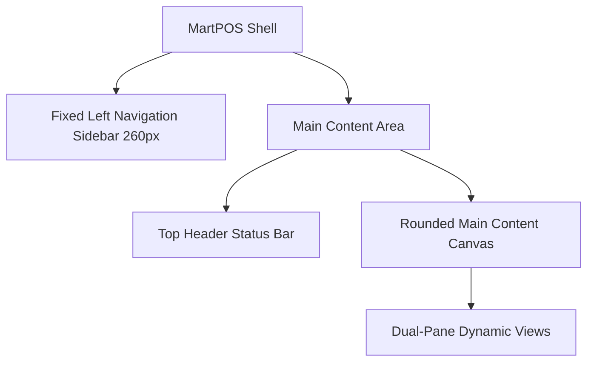

# MartPOS Terminal: Modern UI/UX Design Specification & Style Guide
**Version:** 1.1.0  
**Target Platform:** Windows Desktop (WPF with BlazorWebView-compatible UI)  
**Branding Context:** MartPOS (Enterprise Multi-Tenant, Offline-First Retail POS System)

---

## 1. UI Design Goal

The goal of the **MartPOS** user interface is to deliver an enterprise-grade, highly visual, and lightning-fast desktop experience inspired by the modern **Shopify POS** aesthetic. It is engineered specifically for high-volume retail checkouts where speed, reliability, and ease of use are paramount.

The interface bridges two critical architectural constraints: **multi-tenancy** and **offline-first local operations (backed by a secure SQLite local database)**. The UI must remain responsive under continuous usage and prevent cashier fatigue during long, high-activity shifts.



### Core Design Pillars
*   **Widescreen Terminal Optimization:** Optimized for standard 1366x768 or 1920x1080 touchscreen monitors, maximizing information density without feeling cramped.
*   **Touch-First Visual Targets:** Large, easy-to-tap targets that eliminate the need for precise stylus or mouse input, minimizing scanning delays and operator errors.
*   **Zero-Latency Interaction:** Micro-animations and instant UI states that feel responsive, ensuring operators never feel delayed by visual transitions.
*   **Offline Trust Hierarchy:** Persistent, ambient indicators showing generic fiscal/compliance status, SQLite local database state, and outbox sync status so cashiers are always aware of connectivity and data health.

---

## 2. Visual Style Guide

This section outlines the baseline design system, typography, margins, shadows, and spacing structures that define the look and feel of the MartPOS terminal.

```
+-----------------------------------------------------------------------------------+
|  MartPOS   [ Search products, barcodes (F1)... ]                      [AS]  [  ]  |
+----------------------+------------------------------------------------------------+
| [O] Dashboard        | Category: [ ALL ] [ APPAREL ] [ GROCERY ] [ ELECTRONICS ]  |
| [C] Checkout (Active)| +---------------------------------+ +--------------------+ |
| [I] Inventory        | |                                 | | Active Order #0042 | |
| [O] Sales Orders     | |  [Product Card]                 | | 3 Items            | |
| [P] Payments         | |  Mens Canvas Jacket             | +--------------------+ |
| [S] Shifts           | |  $ 45.00                        | | 1x Canvas Jacket   | |
| [R] Reports          | |  [ Stock: 14 ]                  | |    $ 45.00         | |
| [E] Settings         | |                                 | | 2x Sports Socks    | |
|                      | +---------------------------------+ |    $ 6.00          | |
|----------------------|                                     +--------------------+ |
| Local Sync Status    |                                     | Customer: Adeel S. | |
| [ 0 Pending ]        |                                     +--------------------+ |
| Compliance: OK       |                                     | Subtotal:  $ 51.00 | |
|                      |                                     | Tax (5%):  $  2.55 | |
| [ Light / Dark Mode ]|                                     | TOTAL:     $ 53.55 | |
|                      |                                     +--------------------+ |
|                      |                                     | [  PAY NOW (F12) ] | |
+----------------------+-------------------------------------+----------------------+
```

### Typography
*   **Primary Font Family:** `Manrope` (A modern, geometric sans-serif that balances structural clarity with warmth. Loaded via local asset caching to guarantee offline loading).
*   **Secondary Monospace Font:** `IBM Plex Mono` (Used strictly for ticket numbers, currencies, barcode strings, receipt previews, and technical system status blocks).
*   **Font Weights & Application:**
    *   `ExtraBold (800)`: Used exclusively for currency grand totals, checkout amounts, and primary KPI metrics.
    *   `Bold (700)`: Used for screen headings, modal headers, product titles, and main button labels.
    *   `SemiBold (600)`: Used for card headers, table column headers, and sub-navigation text.
    *   `Medium (500)`: Used for secondary labels, customer details, and regular list item descriptions.
    *   `Regular (400)`: Used for secondary body text, disclaimers, and metadata descriptions.

### Spacing & Grid System
MartPOS utilizes a strict **4px-base spacing system** to maintain structural consistency across all screens:
*   `4px`: Micro padding (badge interiors, thin indicators).
*   `8px`: Small spacing (inside tight lists, label-to-input gap, icon-to-text spacing).
*   `12px`: Medium spacing (standard card padding, product grid gaps, inner modal elements).
*   `16px`: Standard page gutters, main section splits, primary checkout boundaries.
*   `24px`: Large spacing (inner container gaps, modal gutters).
*   `32px`: Hero layout margins, empty state graphic margins.
*   `48px`: The absolute **minimum touch target dimension** for any interactive item (buttons, inputs, filters, tabs).

### Radii & Borders
To convey a premium SaaS aesthetic and soften the layout, rounded elements are utilized consistently:
*   `2px`: Status dot elements and thin outline overlays.
*   `6px`: Small badges, loyalty points indicators, and mini-tags.
*   `8px`: Form input fields, search inputs, barcode indicators, and nested card components.
*   `12px`: Standard product grid cards, metric cards, table containers, and sidebar nav hover elements.
*   `16px`: Action drawers, payment sliders, shift reports, and system modal dialogue backgrounds.
*   `20px / Pill`: Circular profile avatars, category selector chips, active navigation pills, and primary payment triggers.

### Visual Containers & Cards
*   **White Rounded Cards (`#FFFFFF`):** High-density content sits in container cards characterized by a `12px` border radius, a thin `#E7ECEF` border, and an ultra-soft shadow overlay.
*   **Interactive Row Elements:** Table rows and cart entries feature a hover transition that changes background color to `#F5F7F7` to immediately respond to touchscreen hovers.
*   **Active Overlays:** Items selected in lists or product attributes receive a sharp `#111111` outline or a `#35C5A6` mint background highlight.

### Shadows & Depth System
MartPOS uses shadows sparingly to focus the cashier's attention on active operations:
*   **Ambient elevation (Cards):** `0px 2px 4px rgba(16, 16, 16, 0.03)` (Almost flat, distinct card boundaries).
*   **Selected elevation (Hover/Focus):** `0px 6px 16px rgba(16, 16, 16, 0.05)` (Soft glow signaling interactivity).
*   **Modal elevation (Backdrops):** `0px 16px 48px rgba(16, 16, 16, 0.16)` (Strong visual elevation to pull checkout overrides to the front).

---

## 3. Color Palette

The color system features high contrast, clear state representation, and professional retail semantics. It ensures accessibility and prevents eye-strain during 8-to-12 hour cashier shifts.

| Color Token | Hex Code | Visual Application & Usage Rules |
| :--- | :--- | :--- |
| **Canvas Background** | `#F5F7F7` | Core application background. Light gray/off-white. |
| **Card Background** | `#FFFFFF` | Primary card surfaces, product lists, checkout tables, dialog bodies, and the left sidebar. |
| **Main Text** | `#101010` | Stark charcoal black. Applied to all high-hierarchy text, prices, and labels. |
| **Muted Text** | `#7A7F85` | Medium gray-slate. Applied to subtitles, barcode data, and system metadata. |
| **Border / Wireframe** | `#E7ECEF` | Soft gray lines. Used for grid gaps, list borders, and panel dividers. |
| **Active Black** | `#111111` | Jet black. Used for active navigation pills, selected filters, and dark buttons. |
| **Mint Accent (Primary)**| `#35C5A6` | Aqua/Mint green. Used for major POS actions, active checkouts, and successful syncs. |
| **Pink Accent (Secondary)**| `#E1477A` | Soft pink/crimson. Used ONLY for warning/danger highlights, deletes, or errors. |
| **Success Green** | `#10B981` | Standard emerald green. Used for active states and positive reconciliations. |
| **Warning Orange** | `#F59E0B` | Warm amber. Used for outbox warnings, offline mode warnings, and low stock. |

### Semantic Color Rules
*   **Success Indicator:** Must utilize the Mint Accent (`#35C5A6`) or Success Green (`#10B981`). Indicates offline sync queue is fully clear, local database is verified, cash drawer is locked, or payment is fully authorized.
*   **Warning Indicator:** Must utilize Warning Orange (`#F59E0B`). Indicates SQLite cache is currently offline-mode active, outbox sync is pending, hardware is warning-state, or cash drawer limits are near a safe-drop threshold.
*   **Error / Danger Indicator:** Must utilize the Pink Accent (`#E1477A`). Used for invalid manager override codes, print spool failures, transaction cancellations, and server sync errors.

### Light & Dark Theme Rules
1.  **Light Theme (Default / Retail Recommended):** Optimized for high-visibility under harsh retail store lighting.
    *   *App Canvas:* `#F5F7F7`
    *   *Sidebar:* `#FFFFFF` with `#E7ECEF` right border.
    *   *Cards:* `#FFFFFF`
    *   *Navigation Pills (Active):* `#111111` background, `#FFFFFF` text/icon.
    *   *Text:* `#101010`
2.  **Dark Theme (Operator Selectable):** Designed for low-light environments to decrease eye strain.
    *   *App Canvas:* `#121212`
    *   *Sidebar:* `#1E1E1E` with `#2E2E2E` right border.
    *   *Cards:* `#1E1E1E`
    *   *Navigation Pills (Active):* `#35C5A6` background, `#101010` text/icon.
    *   *Text:* `#F5F7F7`
    *   *Border:* `#2E2E2E`

---

## 4. Layout System

The MartPOS UI is built around a unified widescreen app shell that partitions structural regions. This ensures the cashier never loses navigation context during busy shifts.

```
+-------------------------------------------------------------------------------+
|                      |  Search products or scan barcode (F1)...       | AS |  |
|                      |--------------------------------------------------------|
|                      |                                                        |
|     Left Sidebar     |               Main Rounded Content Canvas              |
|       (260px)        |                        (#F5F7F7)                       |
|   Light Background   |                                                        |
|                      |                                                        |
|                      |                                                        |
|                      |                                                        |
|----------------------|                                                        |
| Local Sync Status    |                                                        |
+-------------------------------------------------------------------------------+
```

### Layout Dimensions & Specifications
*   **Fixed Left Sidebar:** Width `260px`. Retains a high-visibility light theme matching the Shopify POS style. Right border is `1px solid #E7ECEF`. Contains brand metadata, operator information, primary navigation, terminal compliance status, and dark mode toggle.
*   **Top Header Status Bar:** Height `56px`. Transparent or light white background (`#FFFFFF`). Houses tenant details, store location, active cashier name, terminal designation, and dynamic system clock.
*   **Main Content Canvas:** Large rounded layout area. Features a soft off-white background (`#F5F7F7`) and utilizes a `12px` border radius on child cards.
*   **Touch Target Safeguards:** 
    *   *Interactive Minimums:* Any element requiring a tap (category filters, plus/minus buttons, order suspension triggers, sidebar items) must occupy a minimum visual boundary of `48px` by `48px` or specify custom outer margins to prevent overlapping inputs.
    *   *Row Height Padding:* Data list rows are padded vertically by a minimum of `12px` to prevent misclicks on touch screens.

---

## 5. Sidebar Navigation

The left navigation sidebar is a primary focal point of the MartPOS shell, styled in clean light tones (`#FFFFFF`) with bold dark accents.

```
+---------------------------------------+
|  MartPOS   [Store ID: LHR-01]         | <- Brand Area
+---------------------------------------+
|                                       |
|  [ ] Dashboard                        |
|  [x] Checkout (Active Pill)           | <- Deep Black Pill, White Text
|  [ ] Inventory                        |
|  [ ] Sales Orders                     |
|  [ ] Payments                         |
|  [ ] Shifts                           |
|  [ ] Reports                          |
|  [ ] Settings                         |
|                                       |
|---------------------------------------|
|  Terminal: POS-01                     |
|  Sync: 0 Pending                      | <- Terminal Status Card
|  Compliance: CERTIFIED                |
|---------------------------------------|
|  [o] Toggle Light/Dark Mode           | <- Bottom Theme Controller
+---------------------------------------+
```

### Navigation Map
*   **Dashboard:** High-level retail overview, sales metrics, sync states, and active session summaries.
*   **Checkout:** The primary checkout register, item lookup, loyalty association, and quick tender tools.
*   **Inventory:** SQLite-cached stock lookup, pricing indices, and category configurations.
*   **Sales Orders:** Invoice records, transaction lookup, returns processing, and receipt reprints.
*   **Payments:** Cash control drawer logs, safe drops, and split payment reconciliations.
*   **Shifts:** Active cashier session management, float declaration, and blind drawer counts.
*   **Reports:** Terminal-specific end-of-day sales data, transaction categories, and shift metrics.
*   **Settings:** Local configurations, hardware driver settings, and network settings.

### Sidebar Style Details
*   **Active Item (Black Pill Style):** When selected, navigation items display in a solid black background (`#111111`) with sharp `#FFFFFF` text and icons. The pill spans `calc(100% - 24px)` of the sidebar width, padded with `12px` vertical margins.
*   **Hover Interaction:** Non-active items transition to `#F5F7F7` on hover. Text color shifts to a full `#101010` black.
*   **Icon Usage:** Consistent rendering weight utilizing Material Symbols Outlined. Active states trigger filled icon weights.
*   **Bottom Terminal-Status Card:** Anchored securely at the bottom of the navigation rail. Houses structural terminal status summaries:
    *   *SQLite DB Engine:* Clean indicator displaying green checkmark when active.
    *   *Sync Outbox Status:* Small status line indicating pending transaction count (turns warning orange if sync has failed or has pending uploads).
    *   *Compliance Certification:* Ambient label showing green `COMPLIANT / CERTIFIED` badge indicating dynamic compliance reports are verified.
*   **Light/Dark Toggle:** Padded toggle switch styled cleanly at the very bottom of the sidebar, enabling cashiers to instantly shift the visual tone of the POS application.

---

## 6. Dashboard Screen Design

The Dashboard serves as the central administrative hub for terminal operators. It prioritizes key diagnostic and operational metrics for high-volume environments.

```
+-----------------------------------------------------------------------------------+
|  Dashboard Overview                                             Friday, 16:13 PM  |
|                                                                                   |
|  +-----------------------+  +-----------------------+  +-----------------------+  |
|  | Today Sales           |  | Pending Sync          |  | Low Stock Items       |  |
|  | $ 1,843.50            |  | 0 Pending             |  | 12 Items Alert        |  |
|  | +4.2% vs yesterday    |  | Database: Connected   |  | Action Required       |  |
|  +-----------------------+  +-----------------------+  +-----------------------+  |
|                                                                                   |
|  +-------------------------------------------+  +------------------------------+  |
|  | Recent Transactions                       |  | System & Diagnostics         |  |
|  |-------------------------------------------|  |------------------------------|  |
|  | #MP-0042  Adeel Saifee   $ 53.55   16:11  |  | Printer: ONLINE              |  |
|  | #MP-0041  Nadia Mirza    $ 12.00   15:58  |  | Scanner: ONLINE              |  |
|  | #MP-0040  Usman Ali      $ 94.50   15:32  |  | Drawer:  ONLINE              |  |
|  +-------------------------------------------+  +------------------------------+  |
+-----------------------------------------------------------------------------------+
```

### Dashboard Layout & Components
*   **Layout Grid:** 3-column top card grid, split below into a wide recent transactions list (`60%` width) and a hardware diagnostics panel (`40%` width).
*   **Today Sales Card:**
    *   *Visual Structure:* A clean white card containing a clear, extra-large numeric sales readout.
    *   *Content Details:* "Today Sales" header, the currency total (`$ 1,843.50`), and a small green success indicator showing trend statistics (`+4.2% vs yesterday`).
*   **Pending Sync Card:**
    *   *Visual Structure:* A card highlighting offline sync health.
    *   *Content Details:* Shows the count of outbox operations currently pending synchronization. When at zero, it displays a bold mint checkmark and "Synced". If transactions are queued, it turns amber with a manual "Force Sync" trigger.
*   **Low Stock Alerts Card:**
    *   *Visual Structure:* High-visibility alert card.
    *   *Content Details:* Exposes critical low inventory levels synced from local database caches, showing a warning orange tag with a quick link to inventory reconciliation.
*   **Storage Maintenance Status:**
    *   *Visual Structure:* A safe diagnostics panel displaying local cache stats.
    *   *Content Details:* Shows local database size, transaction log health, and connection state. Exposes no destructive triggers like direct table vacuuming; instead, exposes a single, safe connection ping tool.
*   **Recent Sales Table:**
    *   *Visual Structure:* A table listing the last five invoices processed on this terminal.
    *   *Content Details:* Displays invoice numbers, cashier names, timestamps, cash total, and sync status.
*   **Sales Overview Chart Placeholder:**
    *   *Visual Structure:* High-density analytics placeholder card.
    *   *Content Details:* A clean card displaying a line graph showing today's sales progression per hour compared to average days, utilizing modern HSL Hues.

---

## 7. Checkout Screen Design

The Checkout screen is the core operational layout of the MartPOS terminal. It features a modern, high-contrast, dual-pane layout designed for maximum speed.

```
+----------------------------------------------------------------------------------+
| Search products, barcodes (F1)...                                    AS [Active] |
+------------------------------------------------+---------------------------------+
| [ ALL ] [ APPAREL ] [ FOOD ] [ ACCESSORIES ]   | Active Order #0042              |
| +--------------------------------------------+ | +-----------------------------+ |
| | [Product Card]          [Product Card]     | | 1x Canvas Jacket              | |
| | Canvas Jacket           Crew Socks         | |    $ 45.00                    | |
| | $ 45.00                 $ 3.00             | | 2x Sports Socks               | |
| | [ Stock: 14 ]           [ Stock: 154 ]     | |    $ 6.00                     | |
| +--------------------------------------------+ | +-----------------------------+ |
| | [Product Card]          [Product Card]     | | Attach Loyalty Customer     | |
| | Fleece Pullover         Thermal Flask      | |-----------------------------| |
| | $ 38.00                 $ 15.00            | | Subtotal:         $ 51.00   | |
| | [ Stock: 22 ]           [ Stock: 8 ]       | | Tax (5% GST):     $  2.55   | |
| +--------------------------------------------+ | | TOTAL:            $ 53.55   | |
|                                                +-------------------------------|
|                                                | [ VOID ]  [ HOLD ]  [ PAY NOW]|
+------------------------------------------------+---------------------------------+
```

### Layout Specifications
*   **Dual-Pane Widescreen Split:** Left column occupies `58%` width (Product Catalog Grid & Search); right column occupies `42%` width (Live Cart, Totals, Loyalty, & Payment Drawer).
*   **Product Search Input:** Positioned at the top of the catalog. A large search bar marked with a scanner icon, a keyboard shortcut indicator (`F1`), and an auto-focus state.
*   **Category Filters:** A horizontal list of pill buttons (e.g., All, Apparel, Food, Accessories) that instantly filter the grid. Active categories feature the active black color; inactive filters feature a light gray outline.
*   **Touch-Friendly Product Cards:**
    *   *Visual Specifications:* Padded cards containing a high-contrast product image, category tag, product title, inventory count, and bold price.
    *   *Tap Target Rule:* Tapping anywhere on the product card instantly adds it to the active cart with a brief, responsive flash animation.
    *   *Low Stock Alert:* If stock is below 10 units, the inventory badge turns orange.
*   **Loyalty Customer Bar:** Positioned at the top of the cart. Displays a dotted, touch-friendly border to search or link customer profiles. When a customer is linked, it displays their name, tier status, and loyalty points.
*   **Live Cart Panel:** A clean list of items in the current transaction. Displays the item name, selected options, unit price, quantity controls (large, tap-friendly `+` and `-` buttons), and the line total.
*   **Totals Panel:** Located at the bottom of the cart panel. Displays a structured overview of the current subtotal, applied discounts, taxes, and the final grand total.
*   **Checkout Trigger Button:** A prominent full-width button utilizing the primary mint accent color (`#35C5A6`). Prominently displays the total due (e.g., `PAY NOW — $ 53.55`) and the hotkey indicator (`F12`).

### 7.1 Checkout Reference Layout — ChecknGo Inspired

This layout is specialized for high-throughput, keyboard-and-touch-optimized retail checkouts. It provides a visual checkout terminal workspace styled to match our ChecknGo-inspired reference layout as closely as possible.

```text
+--------------------------------------------------------------------------------------------------------------+
| [O] POS Terminal (Outer Frame)                                                                               |
| +----------------------------------------------------------------------------------------------------------+ |
| | [MartPOS Terminal]                                                [FS] [Theme] [ Cashier: Adeel S. ]     | |
| |----------------------------------------------------------------------------------------------------------| |
| | [ Search by product name, barcode, SKU... ]  [Sliders]  [ Scan Barcode ]  [ Select Biller/Cashier      v ] | |
| |----------------------------------------------------------------------------------------------------------| |
| |  ORDER DETAILS (2 Items)                         [Clear All]  |  INVOICE                   #INV-2026-0042  | |
| |  +---------------------------------------------------------+  |  +---------------------------------------+ | |
| |  | Product        | Price | Quantity | Subtotal | Action   |  |  | [ Customer ID / Search            ]  | | |
| |  |----------------+-------+----------+----------+----------|  |  | [ + New User ]                        | | |
| |  | [Img] Pullover | $38.0 |  - [2] + | $76.00   | [Trash]  |  |  |---------------------------------------| | |
| |  |  SKU: PL-102   |       |          |          |          |  |  | Subtotal:                    $127.00  | | |
| |  |  Stock: 22     |       |          |          |          |  |  | Tax (5% GST):                  $6.35  | | |
| |  |----------------+-------+----------+----------+----------|  |  | Promo Code: [ PROMO50 ]      [Apply]  | | |
| |  | [Img] Jacket   | $45.0 |  - [1] + | $45.00   | [Trash]  |  |  | Discount:                    -$10.00  | | |
| |  |  SKU: JK-201   |       |          |          |          |  |  | [x] Roundoff                          | | |
| |  |  Stock: 14     |       |          |          |          |  |  |---------------------------------------| | |
| |  +---------------------------------------------------------+  |  | TOTAL PAYABLE:               $123.35  | | |
| |                                                               |  |---------------------------------------| | |
| |                                                               |  | Select Payment Method                 | | |
| |                                                               |  |  +----------+ +----------+ +----------+ | | |
| |                                                               |  |  | [x] Cash | | [ ] Card | | [ ] Scan | | |
| |                                                               |  |  +----------+ +----------+ +----------+ | | |
| |                                                               |  |---------------------------------------| | |
| |                                                               |  |          [ MAKE PAYMENT ]             | | |
| |                                                               |  |    [ HOLD (F6) ]    [ CANCEL (F8) ]   | | |
| |                                                               |  +---------------------------------------+ | |
| +----------------------------------------------------------------------------------------------------------+ |
+--------------------------------------------------------------------------------------------------------------+
```

#### 1. Outer Frame
*   **Physical Style:** Encased in a rounded desktop/tablet-like POS device frame.
*   **Border:** A thick dark outer border simulating terminal hardware bezels.
*   **Canvas:** White main canvas (`#FFFFFF`) sitting on top of a soft shadow background to deliver a clean, professional, dedicated checkout terminal feel.

#### 2. Top Green Header
*   **Width:** Full-width layout bar styled with a solid green background (`#2E7D32`).
*   **Branding:** Left side contains the system logo/brand label: `MartPOS / POS Terminal`.
*   **Right Controls:** Grouped compact utility targets:
    *   *Fullscreen Icon Button:* Triggers widescreen immersion.
    *   *Light/Dark Toggle Button:* Dynamic theme controller.
    *   *Cashier Avatar / Profile Pill:* Shows active operator status.

#### 3. Checkout Toolbar
Positioned directly below the green header to anchor quick lookup capabilities:
*   **Search Box:** A wide search input occupying the left side. Shows placeholder text `Search by product name, barcode, SKU` with keyboard shortcut context (F1).
*   **Filter/Sliders Icon:** Integrated next to the search box for custom catalog filters.
*   **Scan Barcode Button:** Clear touch/click trigger initiating scanner status.
*   **Select Biller/Cashier:** A dropdown list placed on the far right to quickly manage billing ownership.

#### 4. Main Checkout Split Layout
A dual-pane side-by-side split layout:
*   **Left Column (Order Details):** Occupies approximately `65%` of the content width.
*   **Right Column (Invoice/Payment Panel):** Occupies approximately `35%` of the content width.

#### 5. Left Column — Order Details
Encapsulated inside a bordered white card:
*   **Header Section:** Title `ORDER DETAILS` alongside a small numeric item count badge, with a quick `Clear All` button aligned to the right.
*   **Order Grid Table Columns:**
    *   `Product` (Item profile details)
    *   `Price` (Unit price)
    *   `Quantity` (Steppers)
    *   `Subtotal` (Line calculation)
    *   `Action` (Delete icon)
*   **Product Row Design:**
    *   *Height:* Generous `64px` to `76px` row heights to ensure touch-friendly interaction.
    *   *Thumbnail:* Small product image or initials avatar on the left.
    *   *Metadata Stack:* Bold product name, SKU indicator code, and current stock level.
    *   *Quantity Stepper:* A large touch-optimized layout: `[ - ]` button, central quantity value, and `[ + ]` button.
    *   *Subtotal Column:* Bold formatted line total.
    *   *Delete Action:* Clean trash can icon styled with danger colors on hover.
    *   *Dividers:* Separated by soft border dividers (`#EDEDED`) with no visual clutter.

#### 6. Right Column — Invoice Panel
Structured inside a bordered white card:
*   **Header Section:** Title `INVOICE` with the unique invoice number displayed on the top-right.
*   **Customer Fields:** Dotted touch button to attach Customer ID and a secondary `New User` creation button.
*   **Payment Summary:**
    *   *Subtotal:* Base transaction sum.
    *   *Tax:* Computed tax totals.
    *   *Promo Code:* Text input with an adjacent `Apply` button.
    *   *Discount:* Active reduction label.
    *   *Roundoff Toggle:* Simple checkbox/toggle to trigger fractional rounding.
    *   *Total Payable:* Highlighted strongly with extra-large bold formatting.

#### 7. Payment Method Section
Located below the invoice summary:
*   **Title:** `Select Payment Method`
*   **Tiles:** Three horizontal touch-friendly tiles: `Cash`, `Card`, and `Scan / QR`.
*   **Visual Elements:** Centered payment icons inside each tile. The active selection tile receives a prominent green accent background and border.

#### 8. Action Buttons
Positioned at the bottom of the invoice card:
*   **Make Payment:** Full-width green button (`#2E7D32`) highlighting completion.
*   **Hold:** Half-width warning orange button (`#F59E0B` / checkout equivalent) to suspend the cart.
*   **Cancel:** Half-width red button (`#E1477A`) to delete the active transaction.

#### 9. Checkout Color Palette Update
A specialized green-and-gray color palette optimized for high-speed cashier throughput:

| Color Token | Hex Code | Visual Application & Usage Rules |
| :--- | :--- | :--- |
| **Green 900** | `#2E7D32` | Checkout header bar and primary payment action. |
| **Green 100** | `#D6E3D3` | Soft background alerts, subtle active states, and focus states. |
| **Green 200** | `#A7B9A5` | Selected payment method background and active border outlines. |
| **White** | `#FFFFFF` | Cards, table surfaces, input backgrounds, and list containers. |
| **Gray 10** | `#EDEDED` | Border lines, background separation, and grid dividers. |
| **Gray 50** | `#ACACAC` | Muted labels, placeholders, and inactive borders. |
| **Gray 100** | `#333333` | Secondary text, inactive option titles, and labels. |
| **Gray 700** | `#2B2B2B` | Core terminal typography and header borders. |
| **Gray 800** | `#1C1C1C` | Active pills, high-contrast dark buttons, and dark icons. |
| **Gray 900** | `#111111` | Primary text, titles, invoice numbers, and strong UI controls. |

##### Color-Specific Checkout Semantics:
*   Use **Green 900** (`#2E7D32`) for active checkout frames, primary headers, and confirmation payment actions.
*   Use **Green 100** (`#D6E3D3`) and **Green 200** (`#A7B9A5`) for background accents and selected states.
*   Use **White** (`#FFFFFF`) for invoice cards and order detail grids.
*   Use **Gray 10** (`#EDEDED`) as the primary border and divider color.
*   Use **Gray 100** (`#333333`) and **Gray 900** (`#111111`) for crisp dark text and system controls.
*   Use **Red** (`#E1477A` or standard UI red) *only* for cancel, delete, and destructive actions.
*   Use **Orange** (`#F59E0B` or warning amber) *only* for holding or warning states.

#### 10. Typography Update
*   **Font:** `Inter` (geometric, highly readable sans-serif optimized for tabular numbers and labels).
*   **Headers:** Strong, bold headings for sections and card titles.
*   **Table Labels:** Crisp, semi-bold font weights for table columns.
*   **Product Rows:** Compact, highly readable text for SKU labels, price structures, and stock indicators.
*   **Amounts:** Extra-large bold style for the final total payable figure.

#### 11. Important Design Rules
To guarantee terminal speed and prevent cashier delay:
*   **Constant Visibility:** The search input, barcode scan button, invoice panel, total payable, and make payment button must be permanently visible on the screen.
*   **Touch Optimizations:** All row modifications (specifically quantity stepper controls) must use larger targets for touchscreen finger taps.

#### 12. Architectural Constraints
*   **UI Reference Only:** This style guide defines UI behavior; implementation code is strictly separated.
*   **Branding Limits:** Do not refer to actual ChecknGo or Shopify names in any system code or branding; utilize `MartPOS` and `POS Terminal` designations.
*   **BlazorWebView Compatibility:** The styling models must remain fully BlazorWebView-compatible to ensure seamless hybrid desktop integration.
*   **Data Isolation:** Interactive items call state services; direct local database queries within UI views are prohibited.
*   **Hardware Interface:** Outbox triggers, printer operations, and cash drawer actions must route through the approved hardware gateway.

---


## 8. Sales Orders Screen Design

The Sales Orders view is designed for locating prior transactions, reviewing invoices, managing customer returns, and re-printing documents.

```
+----------------------------------------------------------------------------------+
| Sales Orders                                                  [x] Completed Only |
| View, manage, and reprint transaction invoices                                   |
|                                                                                  |
|  [ ALL ] [ COMPLETED ] [ PENDING SYNC ] [ HELD CARTS ] [ RETURNED ]              |
|                                                                                  |
|  +----------------------------------------------------------------------------+  |
|  | Invoice ID | Cashier | Timestamp | Total Amount | Compliance | Status Badge |  |
|  |------------+---------+-----------+--------------+------------+--------------|  |
|  | #MP-0042   | Adeel   | 16:11 PM  | $ 53.55      | SYNCED     | [ COMPLETED ]|  |
|  | #MP-0041   | Nadia   | 15:58 PM  | $ 12.00      | SYNCED     | [ COMPLETED ]|  |
|  | #MP-0040   | Usman   | 15:32 PM  | $ 94.50      | PENDING    | [ PENDING ]  |  |
|  +----------------------------------------------------------------------------+  |
+----------------------------------------------------------------------------------+
```

### Table Specifications
*   **Header Section:** Displays the page title `Sales Orders` with a muted subtitle (`View, manage, and reprint transaction invoices`). Includes a live search bar for quick lookups by invoice ID or customer.
*   **Filter Pills:** Horizontal filter buttons to quickly segment order lists:
    *   *All:* Full historical list.
    *   *Completed:* Finalized sales.
    *   *Pending Sync:* Transactions stored locally in SQLite waiting to sync to the server.
    *   *On Hold:* Suspended carts.
    *   *Returned:* Transactions with processed returns.
*   **Rounded Data Table:**
    *   *Grid Styling:* A clean white table with thin borders, clean columns, and consistent text alignment.
    *   *Status Badges:* High-visibility status tags:
        *   `COMPLETED`: Green badge (`#35C5A6` text and light fill).
        *   `PENDING SYNC`: Amber badge (`#F59E0B` text and light fill).
        *   `VOIDED / RETURNED`: Red/Pink badge (`#E1477A` text and light fill).
*   **Row Action Menu:** Clicking a row opens a drawer menu offering quick actions: `Reprint Receipt`, `Process Return`, or `Force Outbox Sync`.

---

## 9. Tender / Payment Modal

The Payment Modal slides up over the checkout view when the cashier triggers the final checkout process.

```
+--------------------------------------------------------------------+
|  Tender Active Transaction #0042                                   |
|                                                                    |
|  Grand Total Due:                                 $ 53.55          |
|                                                                    |
|  Payment Method:  [ CASH ] [ CREDIT CARD ] [ SPLIT ] [ MOBILE ]    |
|                                                                    |
|  +-----------------------------+  +-----------------------------+  |
|  | Amount Tendered:            |  | Quick Cash Tender:          |  |
|  | $ [ 60.00 ]                 |  | [ $ 10.00 ]  [ $ 20.00 ]    |  |
|  |                             |  | [ $ 50.00 ]  [ EXACT CASH ] |  |
|  +-----------------------------+  +-----------------------------+  |
|                                                                    |
|  Change Due:                                      $ 6.45           |
|                                                                    |
|  [ CANCEL ]                                     [ CONFIRM PAYMENT ]|
+--------------------------------------------------------------------+
```

### Modal Features
*   **Grand Total Display:** A large header displaying the exact payment due (e.g., `$ 53.55`) in extra-large `IBM Plex Mono` typography.
*   **Payment Method Selector:** Horizontal tabs (Cash, Card, Split, Mobile) utilizing large `48px` touch targets.
*   **Amount Tendered Input:** A large input field displaying the entered payment amount.
*   **Quick Cash Buttons:** A grid of pre-calculated cash buttons (e.g., Exact, +$ 5.00, +$ 10.00, +$ 20.00, +$ 50.00) for rapid cash handling.
*   **Change Due Readout:** Highlights change due to the customer in a high-contrast green layout.
*   **Confirm Button:** A large checkout button utilizing the primary mint accent (`#35C5A6`) to finalize the sale.
*   **Cash Drawer Triggering Rule:** 
    *   *Cash Payments:* The confirm action automatically triggers the cash drawer kick-signal through the approved hardware gateway.
    *   *Card/Mobile Payments:* The cash drawer must remain closed upon payment confirmation, preventing unauthorized manual drawer access, unless an explicitly configured tenant business rule bypasses this default and requires an opening.

---

## 10. Manager Override Modal

The Manager Override Modal is a high-security overlay that displays when restricted checkout actions (e.g., item voids, large discounts, drawer openings) are requested.

```
+--------------------------------------------------------------------+
|  Manager Override Required                                         |
|  Action: Void entire order #0042                                  |
|                                                                    |
|  Reason Code:                                                      |
|  [ Customer changed mind                       ] [ Nadia M. (MGR) ]|
|                                                                    |
|  Enter 4-Digit Security PIN:                                       |
|  [ * ]  [ * ]  [ * ]  [   ]                                        |
|                                                                    |
|  [  1  ]  [  2  ]  [  3  ]                                         |
|  [  4  ]  [  5  ]  [  6  ]                                         |
|  [  7  ]  [  8  ]  [  9  ]                                         |
|  [ CLR ]  [  0  ]  [ OK  ]                                         |
+--------------------------------------------------------------------+
```

### Modal Features
*   **Action Details Block:** Displays the specific action being authorized (e.g., `Action: Void entire order #0042`) in a clear alert card.
*   **Reason Code Selector:** A dropdown menu detailing the reason for the override.
*   **Secure Code Display:** Four security cells that fill with bold characters as PIN digits are entered.
*   **Override Numpad:** A highly optimized 3x4 grid of buttons styled with subtle borders and clear touch targets.
*   **Approve/Cancel Action:** Large actions at the bottom of the keypad, utilizing semantic colors to approve or cancel the override.

---

## 11. Shift and Z-Report Screens

MartPOS structures shift cycles to guarantee cash drawer accuracy and local transaction balancing before sync.

```
+--------------------------------------------------------------------+
| Shift Balancing & Reconciliation                                   |
| Terminal: POS-01 | Current Operator: Adeel Saifee                  |
|                                                                    |
|  +-----------------------------+  +-----------------------------+  |
|  | Declared Cash Opening       |  | Z-Report Ledger             |  |
|  | $ 100.00                    |  | Expected Cash: $ 1,943.50   |  |
|  |                             |  | Counted Cash:  $ 1,943.50   |  |
|  +-----------------------------+  +-----------------------------+  |
|                                                                    |
|  Cash Difference:                                  $ 0.00 (OK)     |
|                                                                    |
|  [ Safe Drop: $ 500.00 ]                       [ PRINT Z-REPORT ]  |
+--------------------------------------------------------------------+
```

### Shift Cycle Stages
1.  **Shift Open Screen:**
    *   *Declared Opening Cash:* Visual input card encouraging cashiers to enter their starting float cash.
    *   *Operator Verification:* A clean selection grid to confirm operator name and PIN.
    *   *SQLite Catalog Validation:* Shows a visual status card confirming local SQLite data is loaded and fully synchronized.
2.  **Drawer Cash Reconciliation Ledger:**
    *   *Expected Cash Readout:* Exposes calculated sales and transactions tracked locally.
    *   *Blind Count Entry:* Cashiers enter actual cash values before discrepancies are calculated.
3.  **Z-Report Summary Card:**
    *   *Financial Breakdown:* Displays gross sales, tax, void totals, safe drop counts, and cash drawer balances.
    *   *Print Z-Report Button:* Prints the fiscal shift report and uploads the finalized report to central servers.

---

## 12. Recovery / Sync Screen

The Recovery Screen provides administrators with a interface to monitor network states, outbox queues, and pending print jobs.

```
+--------------------------------------------------------------------+
| Sync & Local Diagnostics                                           |
| Offline operations cache and outbox management                     |
|                                                                    |
|  Sync Outbox:  [ 0 Pending Operations ]   [ FORCE OUTBOX RE-SYNC ] |
|                                                                    |
|  Pending Print Jobs:                                               |
|  +--------------------------------------------------------------+  |
|  | Invoice ID | Queue Timestamp | Error Reason     | Action     |  |
|  |------------+-----------------+------------------+------------|  |
|  | #MP-0042   | 16:11 PM        | Paper Jam/Offline| [ REPRINT] |  |
|  +--------------------------------------------------------------+  |
|                                                                    |
|  Storage Maintenance Status:                    [ Connection OK ]  |
+--------------------------------------------------------------------+
```

### Screen Panels
*   **Pending Sync Queue:** A live sync list displaying pending outbox sync logs. Features progress states and manual sync triggers.
*   **Failed Print Jobs List:** Displays orders that failed to print due to hardware issues, allowing operators to reprint documents.
*   **Storage Maintenance Status:**
    *   *Safe Overview:* Displays SQLite database file health, active WAL mode status, and last maintenance timestamp.
    *   *Execution Rules:* Explains that deep database maintenance (like vacuum operations and re-indexing) runs automatically in the background when the terminal is idle, or during shift closure, ensuring zero cashier intervention or checkout delays.

---

## 13. Component Library

This catalog lists the reusable UI components designed for the MartPOS terminal interface.

```
+-------------------------------------------------------+
|  [ Metric Card Component ]                            |
|  +-------------------------------------------------+  |
|  | Title Label (Muted Text, 11px)                  |  |
|  | Primary Value (ExtraBold, 22px)                 |  |
|  | Trend Badge (Green/Red, 10px)                   |  |
|  +-------------------------------------------------+  |
+-------------------------------------------------------+
```

1.  **AppShell:** Coordinates the 260px light navigation sidebar, top status header, and primary content canvas.
2.  **Sidebar:** Manages terminal navigation, operator profiles, and ambient local sync indicators.
3.  **TopBar:** Displays location context, tenant configurations, shift statuses, and the system clock.
4.  **MetricCard:** A high-visibility dashboard widget displaying key retail and operational metrics.
5.  **StatusBadge:** Semantic tags used to display clean order statuses (e.g., Completed, Pending Sync, On Hold).
6.  **DataTable:** A light, high-density table structure optimized for touchscreens and quick scanning.
7.  **ProductCard:** Grid tile components with clean item images, active categories, prices, and stock indicators.
8.  **CartPanel:** A split panel handling active carts, loyalty customer data, and total price calculations.
9.  **TenderModal:** A slide-up dialogue that manages checkout payments, payment tabs, and cash calculations.
10. **ManagerOverrideModal:** A keypad dialogue requiring manager PIN codes for restricted checkout actions.
11. **HardwareStatusStrip:** Integrated indicators displaying real-time connectivity status for thermal printers and cash drawers.
12. **ShiftSummaryCard:** A detailed dashboard showing active shift details, starting floats, and transaction summaries.
13. **ZReportSummary:** Displays finalized end-of-day sales data, tax collection details, and drawer balances.
14. **RecoveryQueuePanel:** An outbox log display managing pending sync items and manual retry actions.

---

## 14. Do and Don't Rules

To maintain the premium look and speed of the MartPOS interface, developers must adhere to these design guidelines:

### DO:
*   **DO** enforce a minimum `48px` bounding box for all touch targets.
*   **DO** use clean, high-contrast typography hierarchies.
*   **DO** ensure checkout totals and tax calculations are permanently visible during sales.
*   **DO** display outbox sync and SQLite database indicators prominently.
*   **DO** structure checkout modals cleanly using HSL background shades.
*   **DO** use professional POS terms (e.g., Safe Drop, Blind Count, Z-Report).

### DON'T:
*   **DON'T** design complex, decorative landing page layouts.
*   **DON'T** use Shopify-branded terms, logos, or styles.
*   **DON'T** use small, high-density mobile interface designs on desktop POS screens.
*   **DON'T** crowd the UI with excess colors; stick to the curated color palette.
*   **DON'T** show dangerous database commands like "VACUUM CACHE" to operators. Ensure database optimization processes occur in the background or during maintenance modes.

---

## 15. Developer Handoff Notes

Future implementation of the MartPOS user interface must map strictly to this design guide under these technical requirements:

1.  **WPF Host & BlazorWebView Integration:**
    *   The UI must compile and render within a standard WPF host (`POS.Desktop`) via a `BlazorWebView` component.
    *   This architecture enables standard HTML5/CSS3 rendering capabilities and allows for responsive web designs while maintaining full integration with WPF hardware driver gateways (`POS.Desktop.Hardware`).
2.  **State Management & Performance:**
    *   Blazor pages should communicate with application/state services that internally use `PosLocalDbContext` where needed. UI components must not directly own database access logic.
    *   Product and barcode lookup services should use optimized local indexes so scan-to-line interaction feels instant under normal terminal load.
3.  **Local Database Operations:**
    *   Database writes (transactions, invoice logs, cash drawers, sync outboxes) must process within a single local transaction block to avoid UI thread blocking.
    *   Background threads must manage outgoing outbox syncs and compliance reports, keeping the main Blazor rendering loop free of networking latency.
4.  **Styling & Extensibility:**
    *   Styling must be built using native vanilla CSS layout models, aligning with standard viewport units to support diverse touchscreen monitors.
    *   Developers must implement the default Light Theme and Dark Theme classes, keeping CSS variables synchronized with semantic colors.
